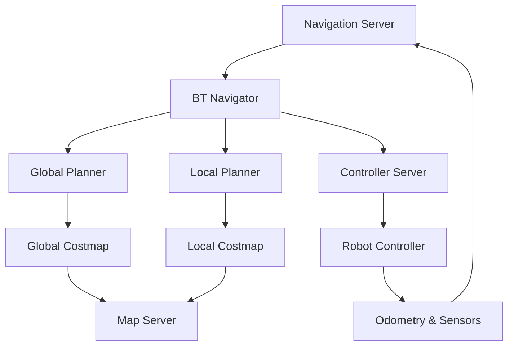

# Nav2 & Path Planning for Humanoid Movement

## Learning Objectives

By the end of this chapter, you will be able to:
1. Understand the Navigation2 (Nav2) architecture and components
2. Configure Nav2 for humanoid robot navigation with bipedal locomotion constraints
3. Implement custom path planners for humanoid movement patterns
4. Integrate Nav2 with humanoid robot controllers and balance systems
5. Optimize navigation for dynamic humanoid environments and gait patterns

## Introduction to Navigation2 (Nav2)

Navigation2 is the next-generation navigation stack for ROS 2, designed to provide robust, flexible, and production-ready navigation capabilities. For humanoid robots, Nav2 requires special consideration due to:

- **Bipedal Locomotion Constraints**: Different movement patterns compared to wheeled robots
- **Balance Requirements**: Need for stable walking gaits during navigation
- **Dynamic Stability**: Center of mass considerations during movement
- **Foot Placement**: Precise footstep planning for safe navigation

## Nav2 Architecture Overview

Nav2 consists of several key components that work together:

- **Navigation Server**: Main orchestrator of navigation tasks
- **Global Planner**: Long-term path planning with global map awareness
- **Local Planner**: Short-term trajectory planning with obstacle avoidance
- **Controller Server**: Trajectory following and execution
- **BT Navigator**: Behavior Tree-based navigation execution
- **Map Server**: Global and local map management
- **Lifecycle Manager**: Component state management

### Nav2 Component Interaction



## Nav2 Configuration for Humanoid Robots

### Basic Nav2 Configuration

```yaml
# nav2_params.yaml
amcl:
  ros__parameters:
    use_sim_time: False
    alpha1: 0.2
    alpha2: 0.2
    alpha3: 0.2
    alpha4: 0.2
    alpha5: 0.2
    base_frame_id: "base_footprint"
    beam_skip_distance: 0.5
    beam_skip_error_threshold: 0.9
    beam_skip_threshold: 0.3
    do_beamskip: false
    global_frame_id: "map"
    lambda_short: 0.1
    laser_likelihood_max_dist: 2.0
    laser_max_range: 100.0
    laser_min_range: -1.0
    laser_model_type: "likelihood_field"
    max_beams: 60
    max_particles: 2000
    min_particles: 500
    odom_frame_id: "odom"
    pf_err: 0.05
    pf_z: 0.99
    recovery_alpha_fast: 0.0
    recovery_alpha_slow: 0.0
    resample_thresh: 0.5
    robot_model_type: "nav2_amcl::DifferentialMotionModel"
    save_pose_rate: 0.5
    sigma_hit: 0.2
    tf_broadcast: true
    transform_tolerance: 1.0
    update_min_a: 0.2
    update_min_d: 0.25
    z_hit: 0.5
    z_max: 0.05
    z_rand: 0.5
    z_short: 0.05
    scan_topic: scan

amcl_map_client:
  ros__parameters:
    use_sim_time: False

amcl_rclcpp_node:
  ros__parameters:
    use_sim_time: False

bt_navigator:
  ros__parameters:
    use_sim_time: False
    global_frame: map
    robot_base_frame: base_footprint
    odom_topic: /odom
    bt_loop_duration: 10
    default_server_timeout: 20
    enable_groot_monitoring: True
    groot_zmq_publisher_port: 1666
    groot_zmq_server_port: 1667
    action_server_result_timeout: 900.0
    navigate_through_poses: False
    navigate_to_pose: True
    # Specify the path where the BT XML files are located
    behavior_tree_xml_filename: "navigate_w_replanning_and_recovery.xml"
    # Recovery behaviors
    recovery_plugins: ["spin", "backup", "wait"]
    spin:
      plugin: "nav2_recoveries/Spin"
    backup:
      plugin: "nav2_recoveries/BackUp"
    wait:
      plugin: "nav2_recoveries/Wait"
    # BT Navigator Parameters
    server_timeout: 20
    clear_entirely_local_costmap: False
    clear_entirely_global_costmap: True
    use_astar: True
    allow_unknown: True
    planner_frequency: 1.0
    deviation_distance: 1.0
    conservative_reset_dist: 3.0
    planner_patience: 5.0
    controller_frequency: 20.0
    controller_patience: 5.0
    max_iterations: 1000
    max_on_approach_iterations: 1000
    max_planning_retries: 5
    enable_partial_plan: True
    enable_straight_path: True

bt_navigator_rclcpp_node:
  ros__parameters:
    use_sim_time: False

controller_server:
  ros__parameters:
    use_sim_time: False
    controller_frequency: 20.0
    min_x_velocity_threshold: 0.001
    min_y_velocity_threshold: 0.5
    min_theta_velocity_threshold: 0.001
    progress_checker_plugin: "progress_checker"
    goal_checker_plugin: "goal_checker"
    controller_plugins: ["FollowPath"]

    # Progress checker parameters
    progress_checker:
      plugin: "nav2_controller::SimpleProgressChecker"
      required_movement_radius: 0.5
      movement_time_allowance: 10.0

    # Goal checker parameters
    goal_checker:
      plugin: "nav2_controller::SimpleGoalChecker"
      xy_goal_tolerance: 0.25
      yaw_goal_tolerance: 0.25
      stateful: True

    # DWB parameters
    FollowPath:
      plugin: "nav2_rotation_shim_controller::RotationShimController"
      primary_controller: "dwb_core::DWBLocalPlanner"

      # Rotation Shim Controller parameters
      max_vel_theta: 1.0
      min_vel_theta: 0.4
      abs_min_rotate_vel_theta: 0.4
      acc_lim_theta: 3.2
      decel_lim_theta: -3.2
      simulate_ahead_time: 1.0

      # DWB Local Planner parameters
      dwb_core:
        plugin: "dwb_core::DWBLocalPlanner"
        debug_trajectory_details: True
        min_vel_x: 0.0
        min_vel_y: 0.0
        max_vel_x: 0.3  # Reduced for humanoid stability
        max_vel_y: 0.0
        max_vel_theta: 1.0
        min_speed_xy: 0.0
        max_speed_xy: 0.3
        min_speed_theta: 0.0
        acc_lim_x: 2.5
        acc_lim_y: 0.0
        acc_lim_theta: 3.2
        decel_lim_x: -2.5
        decel_lim_y: 0.0
        decel_lim_theta: -3.2
        vx_samples: 20
        vy_samples: 5
        vtheta_samples: 20
        sim_time: 1.7
        linear_granularity: 0.05
        angular_granularity: 0.025
        transform_tolerance: 0.2
        xy_goal_tolerance: 0.25
        yaw_goal_tolerance: 0.25
        stateful: True
        restore_defaults: False
        publish_cost_grid_pc: False
        use_dwb: True
        allow_unknown: True
        clear_costmap_freq: 0.0
        use_simple_allowed_area: False
        max_on_approach_velocity: 0.3
        preserve_computed_path: False

local_costmap:
  local_costmap:
    ros__parameters:
      update_frequency: 5.0
      publish_frequency: 2.0
      global_frame: odom
      robot_base_frame: base_footprint
      use_sim_time: False
      rolling_window: true
      width: 6
      height: 6
      resolution: 0.05
      robot_radius: 0.35  # Larger for humanoid safety
      plugins: ["voxel_layer", "inflation_layer"]
      inflation_layer:
        plugin: "nav2_costmap_2d::InflationLayer"
        cost_scaling_factor: 3.0
        inflation_radius: 0.55
      voxel_layer:
        plugin: "nav2_costmap_2d::VoxelLayer"
        enabled: True
        publish_voxel_map: True
        origin_z: 0.0
        z_resolution: 0.2
        z_voxels: 10
        max_obstacle_height: 2.0
        mark_threshold: 0
        observation_sources: scan
        scan:
          topic: /scan
          max_obstacle_height: 2.0
          clearing: True
          marking: True
          data_type: "LaserScan"
          raytrace_max_range: 3.0
          raytrace_min_range: 0.0
          obstacle_max_range: 2.5
          obstacle_min_range: 0.0
      static_layer:
        map_subscribe_transient_local: True
      always_send_full_costmap: True

global_costmap:
  global_costmap:
    ros__parameters:
      update_frequency: 1.0
      publish_frequency: 0.5
      global_frame: map
      robot_base_frame: base_footprint
      use_sim_time: False
      robot_radius: 0.35
      resolution: 0.05
      plugins: ["static_layer", "obstacle_layer", "inflation_layer"]
      obstacle_layer:
        plugin: "nav2_costmap_2d::ObstacleLayer"
        enabled: True
        observation_sources: scan
        scan:
          topic: /scan
          max_obstacle_height: 2.0
          clearing: True
          marking: True
          data_type: "LaserScan"
          raytrace_max_range: 3.0
          raytrace_min_range: 0.0
          obstacle_max_range: 2.5
          obstacle_min_range: 0.0
      static_layer:
        plugin: "nav2_costmap_2d::StaticLayer"
        map_subscribe_transient_local: True
      inflation_layer:
        plugin: "nav2_costmap_2d::InflationLayer"
        cost_scaling_factor: 3.0
        inflation_radius: 0.55
      always_send_full_costmap: True

map_server:
  ros__parameters:
    use_sim_time: False
    yaml_filename: "turtlebot3_world.yaml"

map_saver:
  ros__parameters:
    use_sim_time: False
    save_map_timeout: 5.0
    free_thresh_default: 0.25
    occupied_thresh_default: 0.65
    map_subscribe_transient_local: True

planner_server:
  ros__parameters:
    expected_planner_frequency: 20.0
    use_sim_time: False
    planner_plugins: ["GridBased"]
    GridBased:
      plugin: "nav2_navfn_planner/NavfnPlanner"
      tolerance: 0.5
      use_astar: false
      allow_unknown: true

smoother_server:
  ros__parameters:
    use_sim_time: False
    smoother_plugins: ["simple_smoother"]
    simple_smoother:
      plugin: "nav2_smoother::SimpleSmoother"
      tolerance: 1.0e-10
      max_its: 1000
      w_smooth: 0.9
      w_data: 0.1

behavior_server:
  ros__parameters:
    costmap_topic: local_costmap/costmap_raw
    footprint_topic: local_costmap/published_footprint
    cycle_frequency: 10.0
    behavior_plugins: ["spin", "backup", "wait"]
    spin:
      plugin: "nav2_behaviors/Spin"
      spin_dist: 1.57
    backup:
      plugin: "nav2_behaviors/BackUp"
      backup_dist: 0.15
      backup_speed: 0.025
    wait:
      plugin: "nav2_behaviors/Wait"
      wait_duration: 1.0

velocity_smoother:
  ros__parameters:
    use_sim_time: False
    smoothing_frequency: 20.0
    scale_velocities: False
    feedback: "OPEN_LOOP"
    velocity_timeout: 1.0
    filter_duration: 0.1
    max_velocity: [0.5, 0.0, 1.0]
    min_velocity: [-0.5, 0.0, -1.0]
    max_accel: [2.5, 0.0, 3.2]
    max_decel: [-2.5, 0.0, -3.2]
    odom_topic: "odom"
    velocity_topic: "cmd_vel"
    smoothed_velocity_topic: "cmd_vel_smoothed"
```

## Humanoid-Specific Navigation Configuration

### Custom Costmap for Humanoid Robots

```yaml
# humanoid_nav2_params.yaml
amcl:
  ros__parameters:
    use_sim_time: False
    alpha1: 0.1
    alpha2: 0.1
    alpha3: 0.1
    alpha4: 0.1
    alpha5: 0.1
    base_frame_id: "base_link"
    beam_skip_distance: 0.5
    beam_skip_error_threshold: 0.9
    beam_skip_threshold: 0.3
    do_beamskip: false
    global_frame_id: "map"
    lambda_short: 0.1
    laser_likelihood_max_dist: 2.0
    laser_max_range: 100.0
    laser_min_range: -1.0
    laser_model_type: "likelihood_field"
    max_beams: 60
    max_particles: 2000
    min_particles: 500
    odom_frame_id: "odom"
    pf_err: 0.05
    pf_z: 0.99
    recovery_alpha_fast: 0.0
    recovery_alpha_slow: 0.0
    resample_thresh: 0.5
    robot_model_type: "nav2_amcl::DifferentialMotionModel"
    save_pose_rate: 0.5
    sigma_hit: 0.2
    tf_broadcast: true
    transform_tolerance: 1.0
    update_min_a: 0.2
    update_min_d: 0.25
    z_hit: 0.5
    z_max: 0.05
    z_rand: 0.5
    z_short: 0.05
    scan_topic: scan

# Humanoid-specific local costmap configuration
local_costmap:
  local_costmap:
    ros__parameters:
      update_frequency: 10.0  # Higher frequency for dynamic balance
      publish_frequency: 5.0
      global_frame: odom
      robot_base_frame: base_link
      use_sim_time: False
      rolling_window: true
      width: 10  # Larger window for humanoid planning
      height: 10
      resolution: 0.025  # Higher resolution for precise foot placement
      robot_radius: 0.5  # Larger safety margin for humanoid
      plugins: ["voxel_layer", "inflation_layer", "footprint_layer"]
      inflation_layer:
        plugin: "nav2_costmap_2d::InflationLayer"
        cost_scaling_factor: 5.0  # Higher scaling for safety
        inflation_radius: 0.75  # Larger inflation for humanoid
      voxel_layer:
        plugin: "nav2_costmap_2d::VoxelLayer"
        enabled: True
        publish_voxel_map: True
        origin_z: 0.0
        z_resolution: 0.1  # Finer resolution for humanoid
        z_voxels: 20  # More voxels for humanoid height
        max_obstacle_height: 1.8  # Humanoid height consideration
        mark_threshold: 0
        observation_sources: scan
        scan:
          topic: /scan
          max_obstacle_height: 1.8
          clearing: True
          marking: True
          data_type: "LaserScan"
          raytrace_max_range: 5.0  # Longer range for humanoid planning
          raytrace_min_range: 0.0
          obstacle_max_range: 4.0  # Longer obstacle detection
          obstacle_min_range: 0.0
      static_layer:
        map_subscribe_transient_local: True
      always_send_full_costmap: True

# Humanoid-specific global costmap configuration
global_costmap:
  global_costmap:
    ros__parameters:
      update_frequency: 2.0  # Lower frequency for global planning
      publish_frequency: 1.0
      global_frame: map
      robot_base_frame: base_link
      use_sim_time: False
      robot_radius: 0.5
      resolution: 0.05  # Reasonable resolution for global planning
      plugins: ["static_layer", "obstacle_layer", "inflation_layer"]
      obstacle_layer:
        plugin: "nav2_costmap_2d::ObstacleLayer"
        enabled: True
        observation_sources: scan
        scan:
          topic: /scan
          max_obstacle_height: 1.8
          clearing: True
          marking: True
          data_type: "LaserScan"
          raytrace_max_range: 5.0
          raytrace_min_range: 0.0
          obstacle_max_range: 4.0
          obstacle_min_range: 0.0
      static_layer:
        plugin: "nav2_costmap_2d::StaticLayer"
        map_subscribe_transient_local: True
      inflation_layer:
        plugin: "nav2_costmap_2d::InflationLayer"
        cost_scaling_factor: 5.0
        inflation_radius: 0.75
      always_send_full_costmap: True

# Humanoid-specific controller configuration
controller_server:
  ros__parameters:
    use_sim_time: False
    controller_frequency: 50.0  # Higher frequency for balance control
    min_x_velocity_threshold: 0.001
    min_y_velocity_threshold: 0.001
    min_theta_velocity_threshold: 0.001
    progress_checker_plugin: "progress_checker"
    goal_checker_plugin: "goal_checker"
    controller_plugins: ["HumanoidController"]

    # Progress checker for humanoid
    progress_checker:
      plugin: "nav2_controller::SimpleProgressChecker"
      required_movement_radius: 0.2  # Smaller for precise movement
      movement_time_allowance: 20.0  # More time for humanoid gait

    # Goal checker for humanoid
    goal_checker:
      plugin: "nav2_controller::SimpleGoalChecker"
      xy_goal_tolerance: 0.1  # Tighter tolerance for humanoid
      yaw_goal_tolerance: 0.1  # Tighter orientation tolerance
      stateful: True

    # Humanoid-specific controller
    HumanoidController:
      plugin: "humanoid_nav_controllers::HumanoidPathFollower"
      primary_controller: "humanoid_dwb::HumanoidDWBPlanner"

      # Humanoid controller parameters
      max_vel_x: 0.2  # Slower for stability
      max_vel_theta: 0.3
      min_vel_x: 0.05  # Minimum speed for stability
      min_vel_theta: 0.1
      acc_lim_x: 0.5  # Gentle acceleration for balance
      acc_lim_theta: 0.8
      decel_lim_x: -0.5  # Gentle deceleration
      decel_lim_theta: -0.8

      # DWB parameters adapted for humanoid
      dwb_core:
        plugin: "humanoid_dwb::HumanoidDWBPlanner"
        debug_trajectory_details: True
        min_vel_x: 0.0
        min_vel_y: 0.0
        max_vel_x: 0.2  # Conservative for humanoid
        max_vel_y: 0.0
        max_vel_theta: 0.3
        min_speed_xy: 0.05  # Minimum speed for stability
        max_speed_xy: 0.2
        min_speed_theta: 0.05
        acc_lim_x: 0.5
        acc_lim_y: 0.0
        acc_lim_theta: 0.8
        decel_lim_x: -0.5
        decel_lim_y: 0.0
        decel_lim_theta: -0.8
        vx_samples: 10  # Fewer samples for efficiency
        vy_samples: 1
        vtheta_samples: 15
        sim_time: 2.0  # Longer simulation for stability
        linear_granularity: 0.02  # Finer granularity
        angular_granularity: 0.01
        transform_tolerance: 0.1
        xy_goal_tolerance: 0.1
        yaw_goal_tolerance: 0.1
        stateful: True
        restore_defaults: False
        publish_cost_grid_pc: False
        use_dwb: True
        allow_unknown: True
        clear_costmap_freq: 1.0
        use_simple_allowed_area: False
        max_on_approach_velocity: 0.1
        preserve_computed_path: True
```

## Humanoid Path Planning Implementation

### Custom Path Planner for Humanoid Robots

```python
import rclpy
from rclpy.node import Node
from nav2_msgs.action import ComputePathToPose
from geometry_msgs.msg import PoseStamped, Point
from nav_msgs.msg import Path
from nav2_util.lifecycle_node import LifecycleNode
from nav2_costmap_2d.costmap_2d_ros import Costmap2DROS
from nav2_core.global_planner import GlobalPlanner
from nav2_core.types import PoseWithCostmap
import numpy as np
from scipy.spatial import KDTree
import heapq
import math

class HumanoidGlobalPlanner(GlobalPlanner):
    def __init__(self):
        super().__init__()
        self._costmap = None
        self._global_frame = None
        self._robot_frame = None
        self._footstep_planner = FootstepPlanner()

    def configure(self, node, global_costmap, plugin_name):
        """Configure the planner with costmap and node"""
        self._node = node
        self._logger = node.get_logger()
        self._costmap = global_costmap
        self._global_frame = global_costmap.get_global_frame_id()

        self._logger.info(f'{plugin_name} is configured.')

    def cleanup(self):
        """Clean up the planner"""
        self._logger.info('HumanoidGlobalPlanner is cleaned up.')

    def set_costmap(self, costmap):
        """Set the costmap for the planner"""
        self._costmap = costmap

    def create_path(self, start, goal, planner_id='', use_astar=True):
        """
        Create a path for humanoid robot with footstep planning consideration
        """
        self._logger.info('Creating path for humanoid robot')

        # Convert poses to grid coordinates
        start_grid = self.world_to_grid(start.pose.position.x, start.pose.position.y)
        goal_grid = self.world_to_grid(goal.pose.position.x, goal.pose.position.y)

        if not self.is_valid_coordinate(start_grid) or not self.is_valid_coordinate(goal_grid):
            self._logger.error('Start or goal coordinates are invalid')
            return Path()

        # Check if start or goal are in obstacle space
        if self.is_occupied(start_grid) or self.is_occupied(goal_grid):
            self._logger.error('Start or goal pose is in obstacle space')
            return Path()

        # Plan path using modified A* algorithm for humanoid
        path_grid = self.humanoid_a_star_search(start_grid, goal_grid, use_astar)

        if not path_grid:
            self._logger.error('Failed to find a path')
            return Path()

        # Convert grid path to world coordinates
        world_path = self.grid_path_to_world_path(path_grid)

        # Optimize path for humanoid gait
        optimized_path = self.optimize_for_humanoid_gait(world_path)

        # Generate footstep plan along the path
        footsteps = self._footstep_planner.generate_footsteps(optimized_path)

        # Create final path message
        path_msg = Path()
        path_msg.header.frame_id = self._global_frame
        path_msg.header.stamp = self._node.get_clock().now().to_msg()

        for pose in optimized_path.poses:
            path_msg.poses.append(pose)

        self._logger.info(f'Generated path with {len(path_msg.poses)} waypoints')

        return path_msg

    def world_to_grid(self, x, y):
        """Convert world coordinates to grid coordinates"""
        costmap = self._costmap.get_costmap()
        origin_x = costmap.getOriginX()
        origin_y = costmap.getOriginY()
        resolution = costmap.getResolution()

        grid_x = int((x - origin_x) / resolution)
        grid_y = int((y - origin_y) / resolution)

        return (grid_x, grid_y)

    def grid_to_world(self, grid_x, grid_y):
        """Convert grid coordinates to world coordinates"""
        costmap = self._costmap.get_costmap()
        origin_x = costmap.getOriginX()
        origin_y = costmap.getOriginY()
        resolution = costmap.getResolution()

        x = grid_x * resolution + origin_x
        y = grid_y * resolution + origin_y

        return (x, y)

    def is_valid_coordinate(self, coord):
        """Check if grid coordinate is within map bounds"""
        costmap = self._costmap.get_costmap()
        width = costmap.getSizeInCellsX()
        height = costmap.getSizeInCellsY()

        x, y = coord
        return 0 <= x < width and 0 <= y < height

    def is_occupied(self, coord):
        """Check if grid coordinate is occupied"""
        costmap = self._costmap.get_costmap()
        x, y = coord

        # Check costmap value
        cost = costmap.getCost(x, y)
        return cost >= 253  # Consider costs >= 253 as occupied

    def humanoid_a_star_search(self, start, goal, use_astar=True):
        """A* search algorithm adapted for humanoid navigation"""
        # Priority queue for A* search
        open_set = [(0, start)]
        came_from = {}
        g_score = {start: 0}
        f_score = {start: self.humanoid_heuristic(start, goal)}

        # Closed set to track visited nodes
        closed_set = set()

        while open_set:
            current = heapq.heappop(open_set)[1]

            if current == goal:
                # Reconstruct path
                path = [current]
                while current in came_from:
                    current = came_from[current]
                    path.append(current)
                path.reverse()
                return path

            closed_set.add(current)

            # Get neighbors considering humanoid constraints
            for neighbor in self.get_humanoid_neighbors(current, goal):
                if neighbor in closed_set:
                    continue

                # Calculate tentative g_score
                tentative_g_score = g_score[current] + self.humanoid_distance(current, neighbor)

                # Check if this path to neighbor is better
                if neighbor not in g_score or tentative_g_score < g_score[neighbor]:
                    came_from[neighbor] = current
                    g_score[neighbor] = tentative_g_score
                    f_score[neighbor] = tentative_g_score + self.humanoid_heuristic(neighbor, goal)

                    # Add to open set if not already there
                    if neighbor not in [item[1] for item in open_set]:
                        heapq.heappush(open_set, (f_score[neighbor], neighbor))

        return []  # No path found

    def get_humanoid_neighbors(self, pos, goal):
        """Get valid neighbors for humanoid path planning"""
        neighbors = []
        costmap = self._costmap.get_costmap()

        # Consider 8-connected neighborhood
        directions = [(-1, -1), (-1, 0), (-1, 1),
                      (0, -1),           (0, 1),
                      (1, -1),  (1, 0),  (1, 1)]

        for dx, dy in directions:
            nx, ny = pos[0] + dx, pos[1] + dy

            # Check bounds
            if not self.is_valid_coordinate((nx, ny)):
                continue

            # Check if in obstacle space
            if self.is_occupied((nx, ny)):
                continue

            # Additional humanoid-specific checks
            if self.is_humanoid_safe_path(pos, (nx, ny)):
                neighbors.append((nx, ny))

        return neighbors

    def is_humanoid_safe_path(self, current, next_pos):
        """Check if path segment is safe for humanoid navigation"""
        # Check for narrow passages that might be difficult for humanoid
        costmap = self._costmap.get_costmap()

        # Calculate the direction vector
        dx = next_pos[0] - current[0]
        dy = next_pos[1] - current[1]
        distance = math.sqrt(dx*dx + dy*dy)

        if distance == 0:
            return True

        # Normalize direction
        dx /= distance
        dy /= distance

        # Check points along the path segment
        steps = int(distance)
        for i in range(1, steps + 1):
            check_x = int(current[0] + dx * i)
            check_y = int(current[1] + dy * i)

            if not self.is_valid_coordinate((check_x, check_y)):
                return False

            if self.is_occupied((check_x, check_y)):
                return False

        return True

    def humanoid_heuristic(self, a, b):
        """Heuristic function for humanoid path planning"""
        # Use Euclidean distance with additional penalty for difficult terrain
        dx = a[0] - b[0]
        dy = a[1] - b[1]
        euclidean_dist = math.sqrt(dx*dx + dy*dy)

        # Add penalty based on terrain difficulty
        penalty = self.calculate_terrain_penalty(a, b)

        return euclidean_dist + penalty

    def calculate_terrain_penalty(self, pos1, pos2):
        """Calculate penalty based on terrain difficulty"""
        # In a real implementation, this would consider:
        # - Slope steepness
        # - Surface type
        # - Obstacle density
        # - Step height variations
        return 0.0  # Placeholder

    def humanoid_distance(self, a, b):
        """Calculate distance between two points with humanoid considerations"""
        dx = a[0] - b[0]
        dy = a[1] - b[1]
        base_distance = math.sqrt(dx*dx + dy*dy)

        # Add cost based on terrain difficulty between points
        terrain_cost = self.calculate_terrain_cost(a, b)

        return base_distance + terrain_cost

    def calculate_terrain_cost(self, pos1, pos2):
        """Calculate additional cost based on terrain between two points"""
        # Consider the cost of traversing between the two points
        costmap = self._costmap.get_costmap()

        # Average cost along the path segment
        dx = pos2[0] - pos1[0]
        dy = pos2[1] - pos1[1]
        distance = math.sqrt(dx*dx + dy*dy)

        if distance == 0:
            return 0

        steps = max(1, int(distance))
        total_cost = 0

        for i in range(steps + 1):
            t = i / steps if steps > 0 else 0
            x = int(pos1[0] + dx * t)
            y = int(pos1[1] + dy * t)

            if self.is_valid_coordinate((x, y)):
                cell_cost = costmap.getCost(x, y)
                # Normalize cost (0-255) to (0-1) range
                normalized_cost = min(1.0, cell_cost / 255.0)
                total_cost += normalized_cost

        return total_cost / (steps + 1) if steps > 0 else 0

    def grid_path_to_world_path(self, grid_path):
        """Convert grid path to world coordinates path"""
        path = Path()
        path.header.frame_id = self._global_frame
        path.header.stamp = self._node.get_clock().now().to_msg()

        for grid_x, grid_y in grid_path:
            world_x, world_y = self.grid_to_world(grid_x, grid_y)

            pose = PoseStamped()
            pose.header.frame_id = self._global_frame
            pose.pose.position.x = world_x
            pose.pose.position.y = world_y
            pose.pose.position.z = 0.0
            # Set orientation to face the next point (simplified)
            pose.pose.orientation.w = 1.0

            path.poses.append(pose)

        return path

    def optimize_for_humanoid_gait(self, path):
        """Optimize path for humanoid gait patterns"""
        if len(path.poses) < 2:
            return path

        # Apply path smoothing for smoother humanoid movement
        smoothed_path = self.smooth_path(path)

        # Ensure adequate spacing between waypoints for stable walking
        spaced_path = self.ensure_minimum_spacing(smoothed_path, min_distance=0.1)

        return spaced_path

    def smooth_path(self, path):
        """Apply path smoothing for humanoid navigation"""
        if len(path.poses) < 3:
            return path

        # Use a simple smoothing algorithm
        smoothed_poses = [path.poses[0]]  # Keep start point

        for i in range(1, len(path.poses) - 1):
            # Calculate weighted average of current and neighboring points
            prev_pos = path.poses[i-1].pose.position
            curr_pos = path.poses[i].pose.position
            next_pos = path.poses[i+1].pose.position

            # Weighted average (more weight to neighbors)
            new_x = (prev_pos.x + 2*curr_pos.x + next_pos.x) / 4
            new_y = (prev_pos.y + 2*curr_pos.y + next_pos.y) / 4

            new_pose = PoseStamped()
            new_pose.header = path.poses[i].header
            new_pose.pose.position.x = new_x
            new_pose.pose.position.y = new_y
            new_pose.pose.position.z = curr_pos.z
            new_pose.pose.orientation = curr_pos.orientation

            smoothed_poses.append(new_pose)

        smoothed_poses.append(path.poses[-1])  # Keep end point

        # Create new path
        smoothed_path = Path()
        smoothed_path.header = path.header
        smoothed_path.poses = smoothed_poses

        return smoothed_path

    def ensure_minimum_spacing(self, path, min_distance=0.1):
        """Ensure minimum distance between consecutive waypoints"""
        if len(path.poses) < 2:
            return path

        spaced_poses = [path.poses[0]]  # Always keep start point

        for i in range(1, len(path.poses)):
            current_pos = path.poses[i].pose.position
            last_pos = spaced_poses[-1].pose.position

            distance = math.sqrt(
                (current_pos.x - last_pos.x)**2 +
                (current_pos.y - last_pos.y)**2
            )

            if distance >= min_distance:
                spaced_poses.append(path.poses[i])

        # Always keep end point if it's different from last kept point
        if spaced_poses and spaced_poses[-1] != path.poses[-1]:
            end_distance = math.sqrt(
                (path.poses[-1].pose.position.x - spaced_poses[-1].pose.position.x)**2 +
                (path.poses[-1].pose.position.y - spaced_poses[-1].pose.position.y)**2
            )
            if end_distance >= min_distance:
                spaced_poses.append(path.poses[-1])

        # Create new path
        spaced_path = Path()
        spaced_path.header = path.header
        spaced_path.poses = spaced_poses

        return spaced_path

class FootstepPlanner:
    """Class to handle humanoid footstep planning along a path"""

    def __init__(self):
        self.step_length = 0.3  # meters
        self.step_width = 0.2   # meters (stance width)
        self.max_step_height = 0.1  # maximum step-over height

    def generate_footsteps(self, path):
        """Generate footstep plan along the path"""
        if len(path.poses) < 2:
            return []

        footsteps = []
        left_support = True  # Start with left foot support

        for i in range(len(path.poses) - 1):
            current_pose = path.poses[i]
            next_pose = path.poses[i + 1]

            # Calculate direction vector
            dx = next_pose.pose.position.x - current_pose.pose.position.x
            dy = next_pose.pose.position.y - current_pose.pose.position.y
            distance = math.sqrt(dx*dx + dy*dy)

            if distance > self.step_length:
                # Need to break this segment into multiple steps
                num_steps = int(distance / self.step_length) + 1
                step_dx = dx / num_steps
                step_dy = dy / num_steps

                for j in range(num_steps):
                    step_x = current_pose.pose.position.x + step_dx * (j + 1)
                    step_y = current_pose.pose.position.y + step_dy * (j + 1)

                    # Alternate feet
                    foot_type = "left" if left_support else "right"
                    left_support = not left_support

                    footstep = {
                        'position': (step_x, step_y),
                        'foot_type': foot_type,
                        'timestamp': current_pose.header.stamp
                    }
                    footsteps.append(footstep)

        return footsteps

def register_plugins():
    """Register the humanoid planner plugin"""
    return HumanoidGlobalPlanner()
```

## Humanoid Controller Implementation

### Custom Controller for Humanoid Locomotion

```python
import rclpy
from rclpy.node import Node
from nav2_msgs.action import FollowPath
from geometry_msgs.msg import Twist, PoseStamped, Point
from nav_msgs.msg import Path, Odometry
from tf2_ros import TransformException
from tf2_ros.buffer import Buffer
from tf2_ros.transform_listener import TransformListener
from nav2_core.controller import Controller
from nav2_util.simple_action_server import SimpleActionServer
from rclpy.duration import Duration
from rclpy.qos import QoSProfile
import numpy as np
import math
from scipy.interpolate import interp1d

class HumanoidController(Controller):
    def __init__(self):
        super().__init__()
        self._node = None
        self._goal = None
        self._current_pose = None
        self._current_twist = None
        self._tf_buffer = None
        self._tf_listener = None
        self._action_server = None

        # Humanoid-specific parameters
        self._step_height = 0.05  # Height of step during walking
        self._step_duration = 0.8  # Duration of each step
        self._stance_width = 0.15  # Width between feet during stance
        self._max_velocity = 0.2    # Maximum linear velocity (m/s)
        self._max_angular_velocity = 0.3  # Maximum angular velocity (rad/s)
        self._balance_margin = 0.1  # Safety margin for balance

        # Walking gait parameters
        self._gait_phase = 0.0  # Current phase in the gait cycle
        self._step_counter = 0
        self._left_foot_support = True  # Which foot is in support
        self._swing_foot_trajectory = None

    def configure(self, node, tf_client, costmap_ros):
        """Configure the controller with node and costmap"""
        self._node = node
        self._logger = node.get_logger()
        self._costmap_ros = costmap_ros
        self._costmap = costmap_ros.get_costmap()
        self._global_frame = costmap_ros.get_global_frame_id()
        self._robot_frame = costmap_ros.get_robot_base_frame()

        # Initialize TF
        self._tf_buffer = Buffer()
        self._tf_listener = TransformListener(self._tf_buffer, node)

        # Publishers
        self._velocity_publisher = node.create_publisher(Twist, 'cmd_vel', 1)

        # Subscribers
        self._odom_sub = node.create_subscription(
            Odometry, 'odom', self.odom_callback,
            QoSProfile(depth=1, durability=rclpy.qos.QoSDurabilityPolicy.TRANSIENT_LOCAL))

        self._logger.info('HumanoidController is configured.')

    def activate(self):
        """Activate the controller"""
        self._logger.info('HumanoidController is activated.')
        self._velocity_publisher.enable()

    def deactivate(self):
        """Deactivate the controller"""
        self._logger.info('HumanoidController is deactivated.')
        self._velocity_publisher.disable()

    def cleanup(self):
        """Clean up the controller"""
        self._logger.info('HumanoidController is cleaned up.')
        self._odom_sub.destroy()
        self._velocity_publisher.destroy()

    def setPlan(self, path):
        """Set the plan for the controller to follow"""
        self._logger.info(f'Setting plan with {len(path.poses)} poses')
        self._current_path = path
        self._path_index = 0
        self._gait_phase = 0.0
        self._step_counter = 0
        self._left_foot_support = True

    def computeVelocityCommands(self, pose, velocity):
        """Compute velocity commands for humanoid locomotion"""
        try:
            # Update current pose and velocity
            self._current_pose = pose
            self._current_twist = velocity

            # Get the next target pose from the path
            target_pose = self.get_next_target_pose()
            if target_pose is None:
                # Path completed
                cmd_vel = Twist()
                cmd_vel.linear.x = 0.0
                cmd_vel.angular.z = 0.0
                return cmd_vel, True, "Path completed"

            # Calculate desired velocity based on humanoid gait
            cmd_vel = self.calculate_humanoid_velocity(pose, target_pose, velocity)

            # Check if we've reached the current target
            reached_target = self.has_reached_target(pose, target_pose)

            # Update path index if target reached
            if reached_target:
                self._path_index += 1
                if self._path_index >= len(self._current_path.poses):
                    # Path completed
                    cmd_vel.linear.x = 0.0
                    cmd_vel.angular.z = 0.0
                    return cmd_vel, True, "Path completed"

            # Update gait phase
            self.update_gait_phase(cmd_vel)

            # Apply balance constraints
            cmd_vel = self.apply_balance_constraints(cmd_vel)

            return cmd_vel, False, "Following path"

        except Exception as e:
            self._logger.error(f'Error computing velocity commands: {e}')
            cmd_vel = Twist()
            cmd_vel.linear.x = 0.0
            cmd_vel.angular.z = 0.0
            return cmd_vel, True, f"Error: {str(e)}"

    def get_next_target_pose(self):
        """Get the next target pose from the path"""
        if self._path_index < len(self._current_path.poses):
            return self._current_path.poses[self._path_index]
        return None

    def calculate_humanoid_velocity(self, current_pose, target_pose, current_velocity):
        """Calculate humanoid-appropriate velocity commands"""
        # Calculate distance to target
        dx = target_pose.pose.position.x - current_pose.pose.position.x
        dy = target_pose.pose.position.y - current_pose.pose.position.y
        distance_to_target = math.sqrt(dx*dx + dy*dy)

        # Calculate desired heading
        desired_heading = math.atan2(dy, dx)
        current_heading = self.get_yaw_from_quaternion(current_pose.pose.orientation)

        # Calculate heading error
        heading_error = self.normalize_angle(desired_heading - current_heading)

        # Calculate linear velocity based on distance to target
        # Use a smooth function that decreases as we get closer to target
        if distance_to_target > 0.5:  # Far from target
            linear_vel = min(self._max_velocity, distance_to_target * 0.5)
        elif distance_to_target > 0.1:  # Getting close
            linear_vel = min(self._max_velocity * 0.5, distance_to_target * 1.0)
        else:  # Very close to target
            linear_vel = min(self._max_velocity * 0.2, distance_to_target * 2.0)

        # Calculate angular velocity based on heading error
        # Use PID-like approach for heading correction
        angular_vel = heading_error * 1.0  # Proportional gain

        # Limit angular velocity
        angular_vel = max(-self._max_angular_velocity,
                         min(self._max_angular_velocity, angular_vel))

        # Create velocity command
        cmd_vel = Twist()
        cmd_vel.linear.x = linear_vel
        cmd_vel.angular.z = angular_vel

        # Apply humanoid-specific constraints
        cmd_vel = self.apply_humanoid_constraints(cmd_vel)

        return cmd_vel

    def apply_humanoid_constraints(self, cmd_vel):
        """Apply humanoid-specific motion constraints"""
        # Limit acceleration for balance
        max_linear_acc = 0.3  # m/s²
        max_angular_acc = 0.5  # rad/s²

        # In a real implementation, this would consider:
        # - Current balance state
        # - Zero Moment Point (ZMP) constraints
        # - Center of Mass (CoM) stability
        # - Step timing and foot placement

        # For now, just apply conservative limits
        cmd_vel.linear.x = max(-self._max_velocity, min(self._max_velocity, cmd_vel.linear.x))
        cmd_vel.angular.z = max(-self._max_angular_velocity, min(self._max_angular_velocity, cmd_vel.angular.z))

        return cmd_vel

    def apply_balance_constraints(self, cmd_vel):
        """Apply balance constraints based on humanoid stability"""
        # This would integrate with balance control systems
        # For now, we'll apply conservative limits
        max_stable_linear = 0.15  # Reduced for stability
        max_stable_angular = 0.2

        cmd_vel.linear.x = max(-max_stable_linear, min(max_stable_linear, cmd_vel.linear.x))
        cmd_vel.angular.z = max(-max_stable_angular, min(max_stable_angular, cmd_vel.angular.z))

        return cmd_vel

    def has_reached_target(self, current_pose, target_pose):
        """Check if robot has reached the target pose"""
        dx = target_pose.pose.position.x - current_pose.pose.position.x
        dy = target_pose.pose.position.y - current_pose.pose.position.y
        distance = math.sqrt(dx*dx + dy*dy)

        # Use tighter tolerance for humanoid precision
        position_tolerance = 0.15  # meters
        orientation_tolerance = 0.2  # radians

        current_yaw = self.get_yaw_from_quaternion(current_pose.pose.orientation)
        target_yaw = self.get_yaw_from_quaternion(target_pose.pose.orientation)
        orientation_error = abs(self.normalize_angle(current_yaw - target_yaw))

        return distance <= position_tolerance and orientation_error <= orientation_tolerance

    def update_gait_phase(self, cmd_vel):
        """Update the gait phase based on current velocity"""
        # Simple gait phase update based on movement
        if abs(cmd_vel.linear.x) > 0.01:  # Moving
            # Update gait phase based on step timing
            dt = 0.02  # Assuming 50Hz controller frequency
            self._gait_phase += dt / self._step_duration

            if self._gait_phase >= 1.0:
                self._gait_phase = 0.0
                self._step_counter += 1
                self._left_foot_support = not self._left_foot_support  # Alternate feet
        else:
            # Stationary - reset phase
            self._gait_phase = 0.0

    def get_yaw_from_quaternion(self, quaternion):
        """Extract yaw from quaternion"""
        siny_cosp = 2 * (quaternion.w * quaternion.z + quaternion.x * quaternion.y)
        cosy_cosp = 1 - 2 * (quaternion.y * quaternion.y + quaternion.z * quaternion.z)
        yaw = math.atan2(siny_cosp, cosy_cosp)
        return yaw

    def normalize_angle(self, angle):
        """Normalize angle to [-π, π] range"""
        while angle > math.pi:
            angle -= 2 * math.pi
        while angle < -math.pi:
            angle += 2 * math.pi
        return angle

    def odom_callback(self, msg):
        """Callback for odometry messages"""
        self._current_odom = msg

def register_plugins():
    """Register the humanoid controller plugin"""
    return HumanoidController()
```

## Navigation with Balance Integration

### Humanoid Balance-Aware Navigation

```python
import rclpy
from rclpy.node import Node
from sensor_msgs.msg import Imu, JointState
from geometry_msgs.msg import Twist, PoseStamped
from std_msgs.msg import Float64MultiArray
import numpy as np
import math

class HumanoidBalanceNavigation(Node):
    def __init__(self):
        super().__init__('humanoid_balance_navigation')

        # Initialize balance state
        self.balance_state = {
            'com_position': np.array([0.0, 0.0, 0.8]),  # Center of mass
            'com_velocity': np.array([0.0, 0.0, 0.0]),
            'zmp_position': np.array([0.0, 0.0]),  # Zero Moment Point
            'support_polygon': [],  # Convex hull of support feet
            'balance_margin': 0.05,  # Safety margin
            'is_balanced': True
        }

        # Balance control parameters
        self.balance_params = {
            'zmp_kp': 2.0,  # Proportional gain for ZMP control
            'zmp_kd': 1.0,  # Derivative gain for ZMP control
            'com_height': 0.8,  # Nominal CoM height
            'gravity': 9.81
        }

        # Subscribers
        self.imu_sub = self.create_subscription(
            Imu, '/imu/data', self.imu_callback, 10)
        self.joint_state_sub = self.create_subscription(
            JointState, '/joint_states', self.joint_state_callback, 10)
        self.desired_twist_sub = self.create_subscription(
            Twist, '/navigation_velocity', self.desired_twist_callback, 10)

        # Publishers
        self.balance_status_pub = self.create_publisher(
            Float64MultiArray, '/balance_status', 10)
        self.corrected_twist_pub = self.create_publisher(
            Twist, '/corrected_cmd_vel', 10)
        self.com_visualization_pub = self.create_publisher(
            PoseStamped, '/com_visualization', 10)

        # Balance monitoring timer
        self.balance_timer = self.create_timer(0.02, self.balance_monitor)  # 50 Hz

        self.get_logger().info('Humanoid Balance Navigation initialized')

    def imu_callback(self, msg):
        """Process IMU data for balance estimation"""
        try:
            # Update CoM position and velocity from IMU
            # In practice, this would integrate accelerometer data
            # For now, we'll simulate based on commanded motion

            # Extract orientation
            quat = [msg.orientation.x, msg.orientation.y, msg.orientation.z, msg.orientation.w]
            roll, pitch, yaw = self.quaternion_to_euler(quat)

            # Estimate CoM based on orientation and commanded motion
            # This is a simplified model - real implementation would use full state estimation
            self.balance_state['com_position'][0] += msg.linear_acceleration.x * 0.02  # dt = 0.02
            self.balance_state['com_position'][1] += msg.linear_acceleration.y * 0.02
            # Z component stays relatively constant for walking

            # Update CoM velocity
            self.balance_state['com_velocity'][0] = msg.linear_acceleration.x
            self.balance_state['com_velocity'][1] = msg.linear_acceleration.y

        except Exception as e:
            self.get_logger().error(f'Error processing IMU data: {e}')

    def joint_state_callback(self, msg):
        """Process joint states for foot positions"""
        try:
            # Calculate foot positions from joint angles
            # This would require forward kinematics for your specific humanoid
            left_foot_pos = self.calculate_foot_position(msg, 'left_leg')
            right_foot_pos = self.calculate_foot_position(msg, 'right_leg')

            # Update support polygon
            self.update_support_polygon(left_foot_pos, right_foot_pos)

        except Exception as e:
            self.get_logger().error(f'Error processing joint states: {e}')

    def calculate_foot_position(self, joint_state, leg_name):
        """Calculate foot position using forward kinematics"""
        # This is a placeholder - implement based on your robot's kinematics
        # For a simple model, assume fixed leg length and calculate from joint angles
        return np.array([0.0, 0.0, 0.0])  # Placeholder

    def update_support_polygon(self, left_foot, right_foot):
        """Update the support polygon based on foot positions"""
        # For bipedal walking, support polygon is typically between the feet
        if np.linalg.norm(left_foot - right_foot) < 0.5:  # Reasonable stance width
            # Create convex hull of support polygon
            self.balance_state['support_polygon'] = [
                left_foot[:2],  # X, Y only for 2D support polygon
                right_foot[:2]
            ]
        else:
            # Feet too far apart, unstable
            self.balance_state['support_polygon'] = []

    def desired_twist_callback(self, msg):
        """Process desired twist command and apply balance corrections"""
        try:
            # Check if desired motion is balance-safe
            corrected_twist = self.apply_balance_correction(msg)

            # Publish corrected command
            self.corrected_twist_pub.publish(corrected_twist)

            # Update balance status
            self.publish_balance_status()

        except Exception as e:
            self.get_logger().error(f'Error in desired twist callback: {e}')

    def apply_balance_correction(self, desired_twist):
        """Apply balance constraints to desired twist"""
        corrected_twist = Twist()
        corrected_twist.linear = desired_twist.linear
        corrected_twist.angular = desired_twist.angular

        # Calculate desired ZMP based on desired motion
        desired_zmp = self.calculate_desired_zmp(desired_twist)

        # Check if desired ZMP is within support polygon
        if not self.is_zmp_stable(desired_zmp):
            # Modify twist to bring ZMP back to stable region
            correction_factor = self.calculate_stability_correction(desired_zmp)

            corrected_twist.linear.x *= correction_factor
            corrected_twist.linear.y *= correction_factor
            corrected_twist.angular.z *= correction_factor

        # Update balance state
        self.balance_state['zmp_position'] = desired_zmp

        return corrected_twist

    def calculate_desired_zmp(self, twist):
        """Calculate desired ZMP from twist command"""
        # Simple inverted pendulum model
        com_x = self.balance_state['com_position'][0]
        com_y = self.balance_state['com_position'][1]
        com_z = self.balance_state['com_position'][2]

        # ZMP = CoM projected to ground with acceleration compensation
        gravity = self.balance_params['gravity']
        zmp_x = com_x - (com_z / gravity) * self.balance_state['com_velocity'][0] * 0.1  # Simplified
        zmp_y = com_y - (com_z / gravity) * self.balance_state['com_velocity'][1] * 0.1  # Simplified

        return np.array([zmp_x, zmp_y])

    def is_zmp_stable(self, zmp):
        """Check if ZMP is within stable support polygon"""
        if len(self.balance_state['support_polygon']) < 2:
            return False  # No stable support

        # Check if ZMP is inside support polygon (simplified)
        # In practice, use proper point-in-polygon algorithm
        support_points = np.array(self.balance_state['support_polygon'])

        # Calculate centroid of support polygon
        centroid = np.mean(support_points, axis=0)

        # Check distance to centroid vs safety margin
        distance_to_centroid = np.linalg.norm(zmp - centroid)
        max_allowable_distance = self.balance_state['balance_margin']

        return distance_to_centroid <= max_allowable_distance

    def calculate_stability_correction(self, desired_zmp):
        """Calculate correction factor to stabilize ZMP"""
        if len(self.balance_state['support_polygon']) < 2:
            return 0.0  # Cannot move, completely unstable

        # Find closest point in support polygon to desired ZMP
        support_points = np.array(self.balance_state['support_polygon'])

        # Calculate distances to all support points
        distances = [np.linalg.norm(desired_zmp - point) for point in support_points]
        min_distance_idx = np.argmin(distances)
        closest_support_point = support_points[min_distance_idx]

        # Calculate correction direction
        correction_direction = closest_support_point - desired_zmp
        correction_magnitude = np.linalg.norm(correction_direction)

        # Apply correction based on instability severity
        max_correction = 0.3  # Maximum reduction factor
        correction_factor = max(0.1, 1.0 - min(max_correction, correction_magnitude))

        return correction_factor

    def balance_monitor(self):
        """Monitor balance state and publish status"""
        try:
            # Update balance status
            self.balance_state['is_balanced'] = self.check_balance_stability()

            # Publish balance status
            status_msg = Float64MultiArray()
            status_msg.data = [
                float(self.balance_state['is_balanced']),
                float(self.balance_state['com_position'][0]),
                float(self.balance_state['com_position'][1]),
                float(self.balance_state['zmp_position'][0]),
                float(self.balance_state['zmp_position'][1]),
                float(self.balance_state['balance_margin'])
            ]
            self.balance_status_pub.publish(status_msg)

            # Publish CoM visualization
            self.publish_com_visualization()

        except Exception as e:
            self.get_logger().error(f'Error in balance monitor: {e}')

    def check_balance_stability(self):
        """Check overall balance stability"""
        if len(self.balance_state['support_polygon']) < 2:
            return False

        # Check if ZMP is within support polygon
        current_zmp = self.balance_state['zmp_position']
        return self.is_zmp_stable(current_zmp)

    def publish_com_visualization(self):
        """Publish CoM position for visualization"""
        com_pose = PoseStamped()
        com_pose.header.frame_id = 'map'
        com_pose.header.stamp = self.get_clock().now().to_msg()

        com_pose.pose.position.x = float(self.balance_state['com_position'][0])
        com_pose.pose.position.y = float(self.balance_state['com_position'][1])
        com_pose.pose.position.z = float(self.balance_state['com_position'][2])
        com_pose.pose.orientation.w = 1.0

        self.com_visualization_pub.publish(com_pose)

    def quaternion_to_euler(self, quat):
        """Convert quaternion to Euler angles (roll, pitch, yaw)"""
        x, y, z, w = quat

        # Roll (x-axis rotation)
        sinr_cosp = 2 * (w * x + y * z)
        cosr_cosp = 1 - 2 * (x * x + y * y)
        roll = math.atan2(sinr_cosp, cosr_cosp)

        # Pitch (y-axis rotation)
        sinp = 2 * (w * y - z * x)
        if abs(sinp) >= 1:
            pitch = math.copysign(math.pi / 2, sinp)
        else:
            pitch = math.asin(sinp)

        # Yaw (z-axis rotation)
        siny_cosp = 2 * (w * z + x * y)
        cosy_cosp = 1 - 2 * (y * y + z * z)
        yaw = math.atan2(siny_cosp, cosy_cosp)

        return roll, pitch, yaw

def main(args=None):
    rclpy.init(args=args)
    balance_node = HumanoidBalanceNavigation()

    try:
        rclpy.spin(balance_node)
    except KeyboardInterrupt:
        pass
    finally:
        balance_node.destroy_node()
        rclpy.shutdown()
```

## Integration with Humanoid Controllers

### Complete Navigation System Integration

```python
import rclpy
from rclpy.node import Node
from nav_msgs.msg import Path, Odometry
from geometry_msgs.msg import Twist, PoseStamped, Point
from sensor_msgs.msg import LaserScan, Imu
from std_msgs.msg import Bool, Float64MultiArray
from visualization_msgs.msg import Marker, MarkerArray
import numpy as np
import math

class CompleteHumanoidNavigationSystem(Node):
    def __init__(self):
        super().__init__('complete_humanoid_navigation_system')

        # System state
        self.navigation_state = {
            'is_active': False,
            'is_balanced': True,
            'current_path': [],
            'path_index': 0,
            'current_pose': None,
            'desired_twist': Twist(),
            'corrected_twist': Twist(),
            'balance_status': Float64MultiArray()
        }

        # Navigation parameters
        self.nav_params = {
            'min_distance_to_goal': 0.3,
            'waypoint_tolerance': 0.2,
            'max_linear_velocity': 0.2,
            'max_angular_velocity': 0.3,
            'balance_threshold': 0.1
        }

        # Subscribers
        self.path_sub = self.create_subscription(
            Path, '/plan', self.path_callback, 10)
        self.odom_sub = self.create_subscription(
            Odometry, '/odom', self.odom_callback, 10)
        self.imu_sub = self.create_subscription(
            Imu, '/imu/data', self.imu_callback, 10)
        self.laser_sub = self.create_subscription(
            LaserScan, '/scan', self.laser_callback, 10)
        self.balance_status_sub = self.create_subscription(
            Float64MultiArray, '/balance_status', self.balance_status_callback, 10)

        # Publishers
        self.cmd_vel_pub = self.create_publisher(Twist, '/cmd_vel', 10)
        self.navigation_status_pub = self.create_publisher(Bool, '/navigation_active', 10)
        self.path_viz_pub = self.create_publisher(MarkerArray, '/path_visualization', 10)
        self.goal_viz_pub = self.create_publisher(Marker, '/goal_visualization', 10)

        # Timers
        self.navigation_timer = self.create_timer(0.05, self.navigation_update)  # 20 Hz
        self.visualization_timer = self.create_timer(0.1, self.publish_visualization)  # 10 Hz

        # Navigation state
        self.current_path = []
        self.path_index = 0
        self.has_new_path = False

        self.get_logger().info('Complete Humanoid Navigation System initialized')

    def path_callback(self, msg):
        """Handle new navigation path"""
        self.current_path = msg.poses
        self.path_index = 0
        self.has_new_path = True
        self.navigation_state['is_active'] = True

        self.get_logger().info(f'Received new path with {len(self.current_path)} waypoints')

    def odom_callback(self, msg):
        """Handle odometry updates"""
        self.navigation_state['current_pose'] = msg.pose.pose

        # Update navigation status
        status_msg = Bool()
        status_msg.data = self.navigation_state['is_active']
        self.navigation_status_pub.publish(status_msg)

    def imu_callback(self, msg):
        """Handle IMU updates"""
        # In a real system, this would be used for balance control
        pass

    def laser_callback(self, msg):
        """Handle laser scan for obstacle detection"""
        # Check for obstacles in the path
        if self.navigation_state['is_active'] and self.current_path:
            self.check_path_for_obstacles(msg)

    def balance_status_callback(self, msg):
        """Handle balance status updates"""
        self.navigation_state['balance_status'] = msg
        self.navigation_state['is_balanced'] = bool(msg.data[0]) if len(msg.data) > 0 else True

    def navigation_update(self):
        """Main navigation update loop"""
        if not self.navigation_state['is_active']:
            return

        if not self.current_path:
            self.navigation_state['is_active'] = False
            return

        try:
            # Check if we have valid current pose
            if self.navigation_state['current_pose'] is None:
                return

            # Check balance status
            if not self.navigation_state['is_balanced']:
                self.emergency_stop()
                return

            # Get current target waypoint
            if self.path_index < len(self.current_path):
                target_pose = self.current_path[self.path_index].pose
                desired_twist = self.calculate_path_following_command(
                    self.navigation_state['current_pose'], target_pose)

                # Apply balance constraints
                corrected_twist = self.apply_balance_constraints(desired_twist)

                # Check if reached current waypoint
                if self.has_reached_waypoint(
                    self.navigation_state['current_pose'], target_pose):
                    self.path_index += 1

                    # Check if path is complete
                    if self.path_index >= len(self.current_path):
                        self.navigation_complete()
                        return

                # Publish velocity command
                self.cmd_vel_pub.publish(corrected_twist)
                self.navigation_state['corrected_twist'] = corrected_twist

            else:
                # Path completed
                self.navigation_complete()

        except Exception as e:
            self.get_logger().error(f'Error in navigation update: {e}')
            self.emergency_stop()

    def calculate_path_following_command(self, current_pose, target_pose):
        """Calculate velocity command to follow path"""
        cmd = Twist()

        # Calculate distance and bearing to target
        dx = target_pose.position.x - current_pose.position.x
        dy = target_pose.position.y - current_pose.position.y
        distance = math.sqrt(dx*dx + dy*dy)

        # Calculate desired heading
        desired_heading = math.atan2(dy, dx)
        current_heading = self.get_yaw_from_quaternion(current_pose.orientation)

        # Calculate heading error
        heading_error = self.normalize_angle(desired_heading - current_heading)

        # Calculate linear velocity based on distance
        if distance > 0.5:  # Far from target
            cmd.linear.x = min(self.nav_params['max_linear_velocity'], distance * 0.5)
        elif distance > 0.1:  # Getting close
            cmd.linear.x = min(self.nav_params['max_linear_velocity'] * 0.5, distance * 1.0)
        else:  # Very close
            cmd.linear.x = 0.0

        # Calculate angular velocity for heading correction
        cmd.angular.z = heading_error * 1.5  # Proportional control

        # Limit angular velocity
        cmd.angular.z = max(-self.nav_params['max_angular_velocity'],
                           min(self.nav_params['max_angular_velocity'], cmd.angular.z))

        return cmd

    def apply_balance_constraints(self, desired_twist):
        """Apply balance-based constraints to twist command"""
        corrected_twist = Twist()
        corrected_twist.linear = desired_twist.linear
        corrected_twist.angular = desired_twist.angular

        # Check if current command is balance-safe
        if not self.navigation_state['is_balanced']:
            # Reduce velocity for safety
            reduction_factor = 0.3
            corrected_twist.linear.x *= reduction_factor
            corrected_twist.angular.z *= reduction_factor

        return corrected_twist

    def has_reached_waypoint(self, current_pose, target_pose):
        """Check if robot has reached the target waypoint"""
        dx = target_pose.position.x - current_pose.position.x
        dy = target_pose.position.y - current_pose.position.y
        distance = math.sqrt(dx*dx + dy*dy)

        return distance <= self.nav_params['waypoint_tolerance']

    def check_path_for_obstacles(self, laser_msg):
        """Check if current path has obstacles"""
        if not self.current_path or self.path_index >= len(self.current_path):
            return

        # Get the next few waypoints to check
        check_ahead = min(5, len(self.current_path) - self.path_index)
        for i in range(self.path_index, self.path_index + check_ahead):
            if i >= len(self.current_path):
                break

            waypoint = self.current_path[i].pose
            # Check if this waypoint is blocked by laser scan
            if self.is_waypoint_blocked(waypoint, laser_msg):
                self.get_logger().warn(f'Obstacle detected near waypoint {i}, replanning...')
                # In a real system, this would trigger replanning
                break

    def is_waypoint_blocked(self, waypoint, laser_msg):
        """Check if a specific waypoint is blocked by laser scan"""
        # Convert waypoint to robot frame and check laser ranges
        # This is a simplified implementation
        # In practice, you'd transform to robot frame and check ranges
        return False  # Placeholder

    def navigation_complete(self):
        """Handle navigation completion"""
        self.get_logger().info('Navigation completed successfully')

        # Stop the robot
        stop_cmd = Twist()
        self.cmd_vel_pub.publish(stop_cmd)

        # Deactivate navigation
        self.navigation_state['is_active'] = False

        # Update status
        status_msg = Bool()
        status_msg.data = False
        self.navigation_status_pub.publish(status_msg)

    def emergency_stop(self):
        """Perform emergency stop"""
        self.get_logger().warn('EMERGENCY STOP - Balance compromised')

        # Stop the robot immediately
        stop_cmd = Twist()
        self.cmd_vel_pub.publish(stop_cmd)

        # Deactivate navigation
        self.navigation_state['is_active'] = False

        # Update status
        status_msg = Bool()
        status_msg.data = False
        self.navigation_status_pub.publish(status_msg)

    def get_yaw_from_quaternion(self, quaternion):
        """Extract yaw from quaternion"""
        siny_cosp = 2 * (quaternion.w * quaternion.z + quaternion.x * quaternion.y)
        cosy_cosp = 1 - 2 * (quaternion.y * quaternion.y + quaternion.z * quaternion.z)
        yaw = math.atan2(siny_cosp, cosy_cosp)
        return yaw

    def normalize_angle(self, angle):
        """Normalize angle to [-π, π] range"""
        while angle > math.pi:
            angle -= 2 * math.pi
        while angle < -math.pi:
            angle += 2 * math.pi
        return angle

    def publish_visualization(self):
        """Publish visualization markers"""
        # Publish path visualization
        path_marker = Marker()
        path_marker.header.frame_id = 'map'
        path_marker.header.stamp = self.get_clock().now().to_msg()
        path_marker.ns = 'navigation_path'
        path_marker.id = 0
        path_marker.type = Marker.LINE_STRIP
        path_marker.action = Marker.ADD
        path_marker.pose.orientation.w = 1.0
        path_marker.scale.x = 0.05  # Line width
        path_marker.color.r = 0.0
        path_marker.color.g = 1.0
        path_marker.color.b = 0.0
        path_marker.color.a = 1.0

        for pose_stamped in self.current_path:
            point = Point()
            point.x = pose_stamped.pose.position.x
            point.y = pose_stamped.pose.position.y
            point.z = 0.05  # Slightly above ground
            path_marker.points.append(point)

        self.path_viz_pub.publish(MarkerArray(markers=[path_marker]))

        # Publish goal visualization
        if self.current_path:
            goal_marker = Marker()
            goal_marker.header.frame_id = 'map'
            goal_marker.header.stamp = self.get_clock().now().to_msg()
            goal_marker.ns = 'navigation_goal'
            goal_marker.id = 0
            goal_marker.type = Marker.SPHERE
            goal_marker.action = Marker.ADD
            goal_marker.pose.position = self.current_path[-1].pose.position
            goal_marker.pose.position.z = 0.2  # Above ground
            goal_marker.pose.orientation.w = 1.0
            goal_marker.scale.x = 0.3
            goal_marker.scale.y = 0.3
            goal_marker.scale.z = 0.3
            goal_marker.color.r = 1.0
            goal_marker.color.g = 0.0
            goal_marker.color.b = 0.0
            goal_marker.color.a = 1.0

            self.goal_viz_pub.publish(goal_marker)

def main(args=None):
    rclpy.init(args=args)
    nav_system = CompleteHumanoidNavigationSystem()

    try:
        rclpy.spin(nav_system)
    except KeyboardInterrupt:
        pass
    finally:
        nav_system.destroy_node()
        rclpy.shutdown()
```

## Best Practices for Humanoid Navigation

1. **Balance Integration**: Always consider balance constraints when planning and executing motion
2. **Gait Pattern Matching**: Match navigation commands to natural walking gaits
3. **Step Planning**: Plan foot placements explicitly for stable locomotion
4. **Sensor Fusion**: Integrate multiple sensors for robust state estimation
5. **Safety Margins**: Apply conservative limits for stability
6. **Recovery Strategies**: Implement balance recovery behaviors
7. **Terrain Adaptation**: Adjust parameters based on ground conditions

## Summary

This chapter covered Navigation2 (Nav2) for humanoid robot movement, including:

- Nav2 architecture and configuration for humanoid robots
- Custom path planning algorithms considering humanoid constraints
- Balance-aware navigation and control systems
- Integration with humanoid-specific controllers
- Complete navigation system implementation

Humanoid navigation requires special consideration for bipedal locomotion constraints, balance requirements, and dynamic stability. The implementation must integrate closely with balance control systems to ensure safe and stable navigation.

## Exercises

1. Implement a custom behavior tree for humanoid navigation that includes balance checking.
2. Create a footstep planner that generates stable foot placements along a path.
3. How would you modify the navigation system for different walking speeds?

## Code Example: Humanoid Navigation Launcher

```python
from launch import LaunchDescription
from launch.actions import DeclareLaunchArgument, RegisterEventHandler
from launch.conditions import IfCondition
from launch.event_handlers import OnProcessExit
from launch.substitutions import LaunchConfiguration, PathJoinSubstitution
from launch_ros.actions import Node
from launch_ros.substitutions import FindPackageShare

def generate_launch_description():
    # Launch arguments
    use_sim_time = LaunchConfiguration('use_sim_time')
    params_file = LaunchConfiguration('params_file')
    namespace = LaunchConfiguration('namespace')

    # Nodes
    lifecycle_nodes = ['controller_server',
                       'planner_server',
                       'recoveries_server',
                       'bt_navigator',
                       'waypoint_follower']

    # Navigation lifecycle manager
    nav2_lifecycle_manager = Node(
        package='nav2_lifecycle_manager',
        executable='lifecycle_manager',
        name='lifecycle_manager_navigation',
        parameters=[{'use_sim_time': use_sim_time},
                    {'autostart': True},
                    {'node_names': lifecycle_nodes}]
    )

    # Controller server
    controller_server = Node(
        package='nav2_controller',
        executable='controller_server',
        name='controller_server',
        parameters=[params_file, {'use_sim_time': use_sim_time}],
        remappings=[('cmd_vel', 'cmd_vel_nav')]
    )

    # Planner server
    planner_server = Node(
        package='nav2_planner',
        executable='planner_server',
        name='planner_server',
        parameters=[params_file, {'use_sim_time': use_sim_time}],
        remappings=[('goal_pose', 'goal_pose'),
                    ('plan', 'global_plan')]
    )

    # Behavior tree navigator
    bt_navigator = Node(
        package='nav2_bt_navigator',
        executable='bt_navigator',
        name='bt_navigator',
        parameters=[params_file, {'use_sim_time': use_sim_time}],
        remappings=[('navigate_to_pose', 'navigate_to_pose')]
    )

    # Recovery server
    recovery_server = Node(
        package='nav2_recoveries',
        executable='recoveries_server',
        name='recoveries_server',
        parameters=[params_file, {'use_sim_time': use_sim_time}]
    )

    # Waypoint follower
    waypoint_follower = Node(
        package='nav2_waypoint_follower',
        executable='waypoint_follower',
        name='waypoint_follower',
        parameters=[params_file, {'use_sim_time': use_sim_time}],
        remappings=[('goal_pose', 'goal_pose')]
    )

    # Humanoid-specific nodes
    humanoid_balance_controller = Node(
        package='humanoid_nav',
        executable='balance_controller',
        name='balance_controller',
        parameters=[params_file, {'use_sim_time': use_sim_time}]
    )

    humanoid_path_follower = Node(
        package='humanoid_nav',
        executable='path_follower',
        name='humanoid_path_follower',
        parameters=[params_file, {'use_sim_time': use_sim_time}]
    )

    # Launch description
    ld = LaunchDescription()

    # Declare launch arguments
    ld.add_action(DeclareLaunchArgument(
        'use_sim_time', default_value='false',
        description='Use simulation (Gazebo) clock if true'))

    ld.add_action(DeclareLaunchArgument(
        'params_file',
        default_value=PathJoinSubstitution(
            [FindPackageShare('humanoid_nav'), 'params', 'humanoid_nav2_params.yaml']),
        description='Full path to the ROS2 parameters file to use for all launched nodes'))

    ld.add_action(DeclareLaunchArgument(
        'namespace', default_value='',
        description='Namespace for the nodes'))

    # Add nodes to launch description
    ld.add_action(nav2_lifecycle_manager)
    ld.add_action(controller_server)
    ld.add_action(planner_server)
    ld.add_action(bt_navigator)
    ld.add_action(recovery_server)
    ld.add_action(waypoint_follower)
    ld.add_action(humanoid_balance_controller)
    ld.add_action(humanoid_path_follower)

    return ld
```